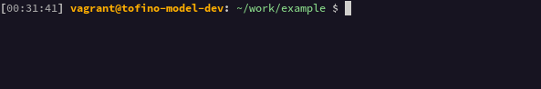
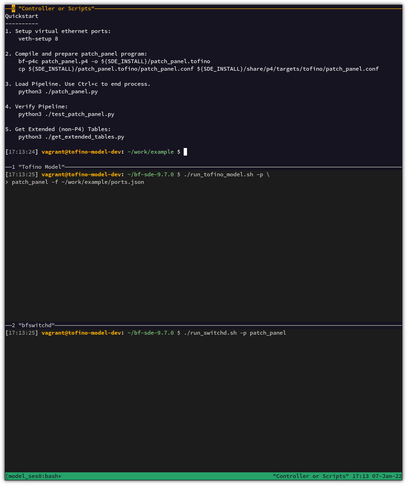
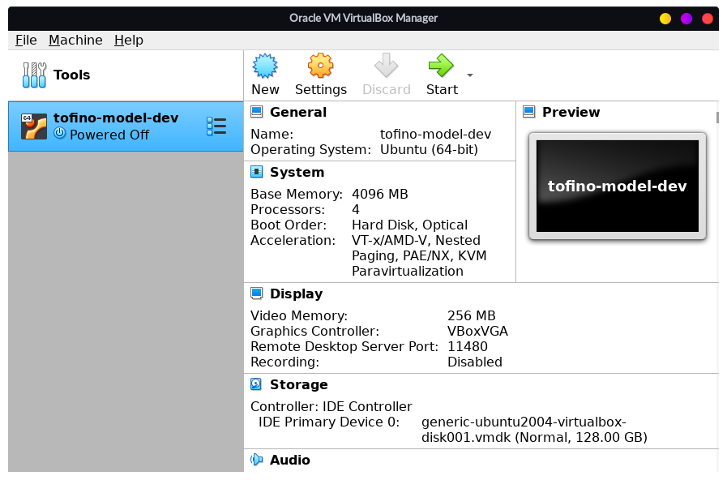
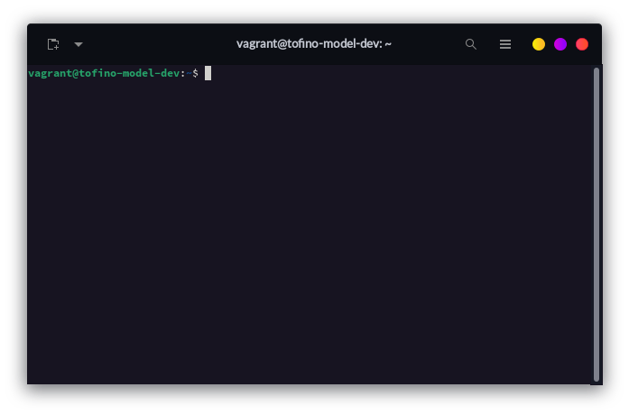
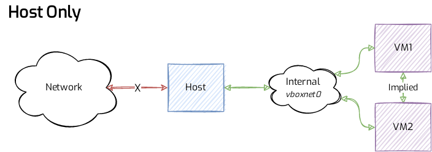
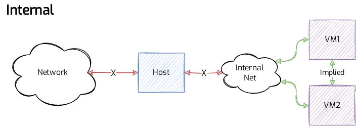
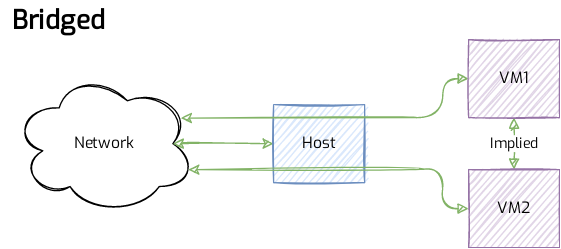
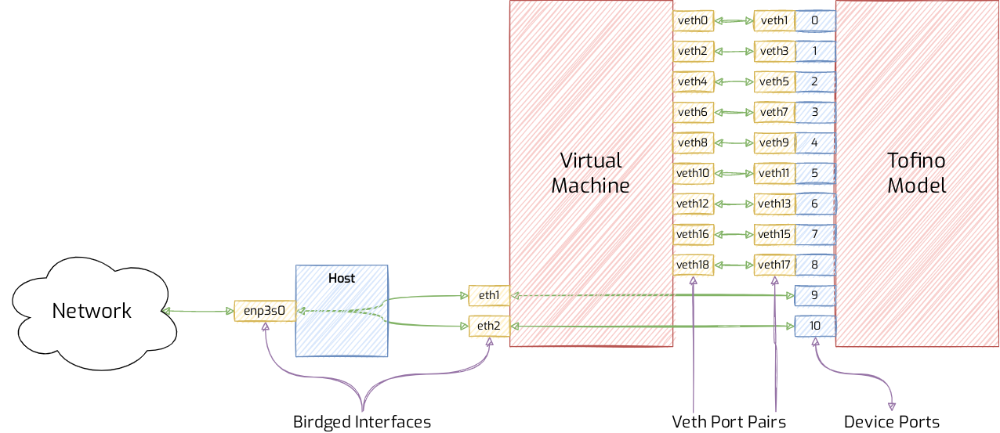

# Tofino Model VM

This project is a Vagrant configuration for provisioning a virtual machine
containing the Intel® Tofino™ Model with related applications, specifically for
use with the Virtual Box hypervisor.

> **Disclaimer**  
>
> 1. This is not a substitute for Intel's documentation and that in the event of
>    any discrepancies, you should refer to their documentation.  
> 2. The building of the virtual machine requires a copy of the Intel Barefoot
>    SDE. This is available under license from Intel and requires the signing of
>    a non-disclosure agreement. We are not able to supply this.  
> 3. As a consequence of point _2_, we are unable to discuss Tofino specific
>    specifications, technical data, workarounds, and other errata.  

> **Note**:  
> This is currently "hard-coded" to work with the 9.7.0 SDE, however this will
> be made more flexible in the future. Updates should still come for later
> SDEs as they are released, regardless.

This is mainly designed for developers who wish to target Tofino with the BfRt 
gRPC interface without the use of a physical switch, specifically with a view of
targeting academia and research, where the use of gRPC is most highly leveraged.

The philosophy here is that abstractions are avoided where possible, but the
model itself is treated as a closed box. This is useful for P4 development and 
experimentation with with the Tofino Native Architecture, without using
low-level APIs.

[Jump straight to getting started!](#quick-start-guide)


Once built the VM contains the SDE and Tofino Model, `bf_switchd` built for
`p4rt` and `bfrt` using a custom profile, the Barefoot compiler, a documentation
server serving this very documentation, an example P4 application, Python helper
libraries for creating BfRt messages and testing packets _without_ using PTF,
and some other useful applications such as Mininet and netcat.

> Programming using the native `C`/`C++` API is likely possible, but this is not
> the goal here.


## Why a Virtual Machine?

Simply because the environment is arguably more controllable and flexible. 
For one, you might want to test applications that themselves use docker.
Using Docker in this way would mean exposing the host Docker to the guest, which
is generally considered a bad idea.

Docker is typically used to provide single PID portable applications, but in
this case, you might have several applications running at the same time. At a
minimum this would include the Tofino Model, and `bf_switchd`. But it could
also extend to a `gRPC` client application, packet test suites, mininet network
etc.

## Requirements

* [Vagrant](https://www.vagrantup.com/). Software for creating virtualised
  development environments.
* [VirtualBox](https://www.virtualbox.org/). Virtualisation software.
* SDE tarball. Distributed from Intel.
* An internet connection.
* At least 8 GB of memory.


## Caveats & Limitations

The following is a non-exhaustive list of known (or potential) issues.

* The `bfrt-helper` library has protobufs compiled with `grpcio-tools` version
  1.43.0. The Python libraries installed by the SDE require 1.17.0. If the later
  version was installed before the SDE, some components would not compile or
  install. However, installing the newer version later does not seem to have the
  same problem. In the process, this upgrades the 1.17.0 install to 1.43.0. It
  is unknown at this time whether this has any material effect on the SDE and it's
  libraries. Some mitigations have been attempted:
    * Attempting to compile the protobuf with verion 1.17.0 of `grpcio-tools` will
        fail; there doesn't actually appear to be a compiler in that release.
    * Attempting to use the protobufs compiled with 1.43.0 with the already
        installed 1.17.0 will not work as there are missing definitions in the
        older library.
  It appears to be working at the moment, but that is not to say issues won't
  arise in the future.
* There are no guides available for mininet.
* Message digest parsing isn't yet available in `async-packet-test`
* This documentation is a work in progress, so things might drastically change
  as time goes on. We intend on replacing the theme at some point, and perhaps
  even change the documentation system entirely (e.g., move from `Apache` to
  `Nginx`, move from `mkdocs` to `jekyll` etc.)


If you have any solutions for the aforementioned issues, please reach out to
<support@aps-networks.com>, or raise an issue
[in this repository](https://github.com/APS-Networks/tofino-model-vagrant/issues).


# Quick Start Guide

## Create and SSH into VM

1. Install Vagrant and VirtualBox

        sudo apt-get install vagrant virtualbox

2. Clone the repository

        git clone https://github.com/APS-Networks/vagrant-tofino-model
    
3. Copy the SDE tarball to `vagrant-tofino-model/sde`

        cd vagrant-tofino-model
        cp ${somepath}/bf-sde-9.7.0.tgz sde/.

4. Build the VM

        vagrant up

5. SSH into the machine

        vagrant ssh


# Included Extras

* Custom message of the day. Basically you'll get a welcome banner with some
  quick start tips when you log in.
* `tmux` configuration that enables mouse mode and colours, along with a script
  that creates a handy set of panes with two in the SDE for the model and one
  in the example directory.
* Simple virtual ethernet scripts that set up `${count}` number of ports,
  saving their names to a file, and another to teardown those that have been
  saved.
* [Asynchronous Packet Test](https://github.com/CommitThis/async-packet-test)
  Python library for writing tests based on apcket expectations with the use of
  PTF.
* [BfRt Helper](github.com/APS-Networks/bfrt-helper) Python library for help
  crafting BfRt gRPC messages.
* A custom prompt, to make it easier to differentiate between the host and guest
  terminals:
    


# Online Documentation


## Vagrant Tofino Model
This documentation will be available on the host from a web browser a
[localhost:4000](localhost:4000). This is dependent on the default interface
configuration not being modified, your mileage may vary otherwise.


## BfRt gRPC Helper

A helper library for creating Barefoot Runtime gRPC messages easily.

* [Local link](http://localhost:4000/bfrt-helper)
* [GitHub](https://localhost:4000/bfrt-helper)

## Async Packet Testing

A library for creating simple and human readable tests against future "expected"
packets.

* [Local link](http://localhost:4000/async-packet-test)
* [GitHub](https://committhis.github.io/async-packet-test)


# Using the Model

## Compiling and Installing a Program

The Intel SDE provides a CMake based technique for compiling and installing
P4 programs. While it is reasonably straight forward, it is highly coupled with
the SDE build system, possibly making it difficult to integrate with an
existing (or separate) build environment.

For our sample `patch_panel` program, the process is:

```bash
mkdir build && cd build

cmake ${SDE}/p4studio \
    -DCMAKE_INSTALL_PREFIX=${SDE_INSTALL} \
    -DCMAKE_MODULE_PATH=${SDE}/cmake \
    -DP4_NAME=patch_panel \
    -DP4_PATH=${p4_program_path}

make && make install
```

> Note how `cmake` is being directed to the `CMakeLists.txt` file in the 
> `p4studio` directory.

* The program configuration (`patch_panel.conf`) will be installed to
  `${SDE_INSTALL}/share/p4/targets/tofino/`
* The program artefacts (e.g., `bf-rt.json`, `tofino.bin`) will be installed to
  `${SDE_INSTALL}/share/tofinopd/patch_panel`

Once this is done, you will be able to start both the Tofino Model and 
`bf_switchd` using the shorthand `-p` option; rather than supplying the full
path to the configuration file, you can just use the program name.

### Further Explanation

The CMake helper is provided since compiling a program to work "properly" with
the SDE is a multi-step process:
1. The program is compiled alongside a configuration file describing the
   artefacts and their paths;
2. The program is prepared for installation, and the artefact paths are
   arranged for this purpose.

When the `bf-p4c` compiler is invoked, alongside the program binary, a
`${program}.conf` file is generated describing the compiled artefacts and their
paths. If an output directory argument is not supplied, the binaries and 
configuration file will be output to a directory named
`${program_name}.${asic_target}`, and the paths in the configuration file will
be relative to the directory in which the compiler is invoked.

If a relative output directory is supplied, those paths will be relative to
that, and if an absolute output path is supplied, all paths will also be
absolute.

This is important to remember when starting a program because if the paths are
relative in `context.json` they are evaluated relative to `${SDE_INSTALL}`.

The "idiomatic" installation of a program is as described in the previous
section; configuration files are in `${SDE_INSTALL}/share/p4/targets/tofino`,
and program artefacts are in `${SDE_INSTALL}/share/tofinopd/${PROGRAM_NAME}`.
Consequently, the configuration file paths need to be prepared. This is done
by calling `p4c-gen-bfrt-conf`, which basically rewrites this file.


## Running a Program

Running a P4 program on the Tofino Model is a two step process. First you must
start the model itself, supplying the port configuration and program. Then you
must start `bf_switchd`, also supplying the program. These are both long
running processes, and will need to be run in their own terminal or shell.

> **Note:** Supplying the program name to the Tofino Model is not strictly 
> necessary, however, it enables the generation of more detailed logging.

We haven't gone to the trouble of supplying a startup script that `fork`s the
two processes; that is an exercise for the reader. In any case, assuming the
program installation instructions have been followed:

In the first terminal:

    cd ${SDE}
    ./run_tofino_model -p ${program} -f ${port_config_path}

And in the second:

    cd ${SDE}
    ./run switchd -p ${program}

Really very straightforward.


### Port Configuration

The port configuration is contained in the `ports.json` file. It tells the
Tofino Model which ports it should bind to, to present to `bf_switchd` as
switchports. These can either be virtual ethernet (`PortToVeth`), or bound to an
adapter (`PortToIf`).

While in practice, these assignments can be made arbitrarily (and indeed some
of the examples provided with the SDE are), we are assigning each device port 
linearly from 0, firstly for each `veth` port pair starting with 0, and device
ports 9 and 10 are bound to a local interface.

A small example follows:

```json
{
    "PortToVeth": [
        {
            "device_port": 0,
            "veth1":0,
            "veth2":1
        }
    ],
    "PortToIf": [
        {
            "device_port": 9,
            "if":"eth1"
        }
    ]
}
```

The virtual machine contains two scripts to assist with the creation of 
virtual ethernet port pairs. They _are_ name similarly to those provided by
the SDE, however are little more user friendly at the expense of being less
configurable. 

* `veth-setup`: Accepts a count of pairs to set up. The created port pair names
  will be stored in a file in `/tmp`.
* `veth-teardown`: Reads the port pair file from `/tmp` and removes them in
  turn.

They are included in `${PATH}`


# An Example Program

The example program is located in the `work` directory of this repository, which
in turn is synchronised to the `/home/vagrant/work` directory on the guest. This
is a fairly straight forward method of having work shared between the host and
the guest -- you can use development tools on the host for code that is also
present on the guest.

The program is a very simple. It consists of a single table that matches a
packet against it's input port, which itself is contained with the intrinsic
packet metadata (i.e, metadata generated by the Tofino for you). If no table
entries are added, it is a black hole. It also contains a counter; however no
examples have been provided for reading this yet.


### Convenience `tmux` Session

The example program has included a script that sets up and attaches to a `tmux`
session. The session is created with 3 panes:

1. For general scripts including controllers, tests, basically a free for all;
2. One for running the Tofino model;
3. One for running `bf_switchd`




## patch_panel.p4

```cpp
#include <tna.p4>

struct PatchPanelIngressMeta_t    { /* empty */ }
struct PatchPanelIngressHeaders_t { /* empty */ }

struct PatchPanelEgressMeta_t     { /* empty */ }
struct PatchPanelEgressHeaders_t  { /* empty */ }


parser PatchPanelIngressParser(
        packet_in packet,
        out PatchPanelIngressHeaders_t hdr,
        out PatchPanelIngressMeta_t meta,
        out ingress_intrinsic_metadata_t ig_intr_md)
{
    state start {
        packet.extract(ig_intr_md);
        packet.advance(PORT_METADATA_SIZE);
        transition accept;
    }
}

#define COUNTER_INDEX_WIDTH 9
#define COUNTER_VALUE_WIDTH 32
#define COUNTER_COUNT 1 << COUNTER_INDEX_WIDTH
typedef bit<COUNTER_INDEX_WIDTH> PacketCount_t;


control PatchPanelIngressControl(
        inout PatchPanelIngressHeaders_t hdr,
        inout PatchPanelIngressMeta_t meta,
        in ingress_intrinsic_metadata_t ig_intr_md,
        in ingress_intrinsic_metadata_from_parser_t ig_prsr_md,
        inout ingress_intrinsic_metadata_for_deparser_t ig_dprsr_md,
        inout ingress_intrinsic_metadata_for_tm_t ig_tm_md)
{
    Counter<bit<32>, PortId_t>(COUNTER_COUNT, CounterType_t.PACKETS) pkt_counter;


    action forward(PortId_t egress_port) {
        ig_tm_md.ucast_egress_port = egress_port;
    }

    action drop() {
        ig_dprsr_md.drop_ctl = 1;
        exit;
    }

    table port_forward {
        key = {
            ig_intr_md.ingress_port: exact;
        }
        actions = {
            drop;
            forward;
        }
        size = 512;
        default_action = drop;
    }
    apply { 
        port_forward.apply();
        pkt_counter.count(ig_intr_md.ingress_port);
    }
}


control PatchPanelIngressDeparser(
        packet_out packet,
        inout PatchPanelIngressHeaders_t hdr,
        in PatchPanelIngressMeta_t meta,
        in ingress_intrinsic_metadata_for_deparser_t ig_dprsr_md)
{
    apply { }
}


parser PatchPanelEgressParser(
        packet_in packet,
        out PatchPanelEgressHeaders_t hdr,
        out PatchPanelEgressMeta_t meta,
        out egress_intrinsic_metadata_t eg_intr_md)
{
    state start {
        packet.extract(eg_intr_md);
        transition accept;
    }
}


control PatchPanelEgressControl(
        inout PatchPanelEgressHeaders_t hdr,
        inout PatchPanelEgressMeta_t meta,
        in egress_intrinsic_metadata_t eg_intr_md,
        in egress_intrinsic_metadata_from_parser_t eg_prsr_md,
        inout egress_intrinsic_metadata_for_deparser_t eg_dprsr_md,
        inout egress_intrinsic_metadata_for_output_port_t eg_oport_md)
{
    Counter<bit<32>, PortId_t>(COUNTER_COUNT, CounterType_t.PACKETS) pkt_counter;

    apply {
        pkt_counter.count(eg_intr_md.egress_port);
    }
}


control PatchPanelEgressDeparser(packet_out packet,
        inout PatchPanelEgressHeaders_t hdr,
        in PatchPanelEgressMeta_t meta,
        in egress_intrinsic_metadata_for_deparser_t eg_dprsr_md)
{
    apply { }
}


Pipeline(
    PatchPanelIngressParser(),
    PatchPanelIngressControl(),
    PatchPanelIngressDeparser(),
    PatchPanelEgressParser(),
    PatchPanelEgressControl(),
    PatchPanelEgressDeparser()
) pipe;

Switch(pipe) main;

```

## Manipulating

APS Networks has written a helper library for crafting gRPC messages for the
BfRt Runtime, that are checked for correctness in terms of names and data types.
This library is [available separately in Github](https://github.com/APS-Networks/bfrt-helper).

The following snippet sets up the TNA equivalent of arbitration, and writes a
table entry redirecting packets from device port 1, to device port 0. This
assumes that you have already configured and created a gRPC connection to the 
machine.


```python
from bfrt_helper.bfrt import BfRtHelper
from bfrt_helper.bfrt_info import BfRtInfo
from bfrt_helper.fields import PortId
from bfrt_helper.match import Exact

bfrt_data = json.loads(open(BFRT_PATH).read())
bfrt_info = BfRtInfo(bfrt_data)
bfrt_helper = BfRtHelper(DEVICE_ID, CLIENT_ID, bfrt_info)

# Assumes you have correctly set up a gRPC connection to the Tofino, and that
# you have a message queue etc.
request = bfrt_helper.create_subscribe_request()
stream_out_queue.put(request)
stream_in_queue.get()

INGRESS_PORT = 1
EGRESS_PORT = 0

write_request = bfrt_helper.create_table_write( 
    program_name='port_forward', 
    table_name='pipe.PatchPanelIngressControl.port_forward',
    key={
        'ig_intr_md.ingress_port': Exact(PortId(INGRESS_PORT))
    },
    action_name='PatchPanelIngressControl.forward',
    action_params={
        'egress_port': PortId(EGRESS_PORT),
    })

response = client.Write(write_request)
```

Running the example controller should produce an output similar to the
following:

```text
vagrant@tofino-model-dev:~/work/example$ python3 ./patch_panel.py 
Stream sending:  subscribe {
  notifications {
    enable_learn_notifications: true
    enable_idletimeout_notifications: true
    enable_port_status_change_notifications: true
  }
}

Stream received:  subscribe {
  status {
  }
}
```

> **Note:** The controller script will 'hang'; there is a thread in the background
> managing the input output queue for gRPC stream messages. To close, just
> CTRL+C.


## Testing

You can test a program using the Packet Testing Framework (PTF), or, we supply
an open source library that enables you to do this without.

Following the above example, we have directed all packets from the second (port 1)
device port to the first (port 0). These map to the `veth2` <-> `veth3` and
`veth0` <-> `veth1` port pairs, respectively.

So the simple test here is to send a packet to `veth2` and assert that it was
received on `veth0`. In order to make sure we don't pick up any old packet, 
we'll specifically craft one that probably wouldn't be generated anywhere
(i'm looking at you SSDP and MDNS).


```python
from scapy.all import Ether, IP, ICMP, sendp, Dot1Q
from async_packet_test.context import make_pytest_context
from async_packet_test.predicates import Predicate,
from async_packet_test.predicates import saw_vlan_tag
from async_packet_test.predicates import did_not_see_vlan_tag

context = make_pytest_context()

packet = Ether() / Dot1Q(vlan=102) / IP() / ICMP()


def test_saw_vlan_tag_veth2(context):
    result = context.expect('veth0', saw_vlan_tag(102))
    sendp(packet, iface='veth2')
    result.assert_true()


def test_did_not_see_vlan_anywhere_else(context):
    results = [
        context.expect('veth4', saw_vlan_tag(102)),
        context.expect('veth6', saw_vlan_tag(102)),
        context.expect('veth8', saw_vlan_tag(102)),
        context.expect('veth10', saw_vlan_tag(102)),
        context.expect('veth12', saw_vlan_tag(102)),
        context.expect('veth14', saw_vlan_tag(102)),
    ]

    sendp(packet, iface='veth2')

    for result in results:
        assert not result
```

When running `sudo python3 -m pytest`, we should see something like this:

```text
vagrant@tofino-model-dev:~/work/example$ sudo python3 -m pytest
=========================== test session starts ===========================
platform linux -- Python 3.8.10, pytest-6.2.5, py-1.11.0, pluggy-1.0.0
rootdir: /home/vagrant/work/example
collected 2 items                                                         

test_patch_panel.py ..                                              [100%]

============================ 2 passed in 0.46s ============================
```

> **Note:** Currently it does not appear to be possible to set up capabilities
> for pytest. Therefore, all of the libraries have been installed globally so
> they are acessible via `sudo`.


# Configuration

## Machine Settings

The machine is configured with the following settings:

### Core Specifications

The core specifications for the machine are:
* 4 CPU cores;
* 4 Gigabytes of memory;

The default hard disk size is used (or is not configured).

The core specifications are actually provided by VirtualBox, not Vagrant, and
as such a special configuration section is used.

```ruby
config.vm.provider "virtualbox" do |vb|
  vb.cpus = 4
  vb.memory = "4096"
  vb.name = "tofino-model-dev"
end
```

This also sets the name that VirtualBox will know the machine as. If you open
up VirtualBox once the machine as been provisioned, you will something like
this (depending on whether it has been started):



### Operating System

The base OS is `generic/ubuntu2004`. While any other operating system is not
"technically" supported, it is possible to change. I would recommend that a
Debian like OS is chosen, however, as the vast majority of provisioning scripts
use `Aptitude` for package installation, and the `Python` configuration is setup
based on the available version in the Ubuntu apt repositories.

This is configurable in the Vagrantfile via:

```ruby
config.vm.box = "generic/ubuntu2004"
```

> **Note:** Vagrant boxes (or OSes) are versioned. At the time of writing, the
> version used by this repository is `3.6.0`. It is not known whether upgrading
> the box version will have any impact on the running of the machine.

To search for available boxes, visit the
[Vagrant discover search](https://app.vagrantup.com/boxes/search).

### Vagrant Machine Name

The Vagrant machine name `tofino-model-dev`. This is what Vagrant will know the
machine as and is required by or displayed by various Vagrant query operations.

This is applied in the Vagrantfile via:

```ruby
config.vm.define "tofino-model-dev"
```

### VirtualBox Machine Name

See [Core Specifications](#core-specifications)

### Hostname
The hostname `tofino-model-dev`. This is the hostname configured on the machine,
e.g., what's displayed on a terminal prompt. There's not much more to say on
this, but have a nice image anyway:




## Network Configuration

By default, Vagrant+Virtualbox creates the VM in a NATed network configuration.
That is to say that the guest is not directly accessible by the host except
through specific forwarded ports. This is applied to the first interface, and
it's not advisable to change. For one, the SSH command may not work correctly,
forcing you to come up with some other method of gaining shell access.

One port has already been forwarded: `80` on the host is forwarded as `4000`.
This is to provide access to the live documentation.

There are three further options you can use:

* Host only, where a VM exists on a network only accessible from the host;
* Internal, the VM exists on an internal network that has no connectivity to
  the host, and consequently, the world writ large;
* Bridged, where the network connections on the guest are directly exposed to
  the host's own network, and as such standard network services like DHCP will
  be applicable.






Bridged may be an interesting topology, as it would enable Tofino ports direct
access to a network:


### Make Model Available on The Network

It is possible to expose the model easily to the outside world! This requires
some modification to the Vagrant configuration, as well as the port
configuration supplied to the Tofino Model as it launches.

1. In the Vagrant configuration, add a public network interface with a type of
   "bridge". The interface supplied to the bridge argument is the interface on 
   the host with which the bridge is bound to.

        config.vm.network "public_network", ip: "10.0.0.11", bridge: "enp3s0"

2. Modify the `ports.json` file to have the model bind a device port to it:

        {
            // other configs here...
            "PortToIf": [
            {
                "device_port": 9,
                "if":"eth1"
            }
        }

    > Note that the interface names may be arbitrary, we have observed the are
    > typically named eth1, eth2,... ethN etc. In this case, `eth1` is the
    > name of the interface within the guest that is bridged to the outside 
    > world.

An example topology might look like this:




When running the model with a bridged port, it should start displaying
processing state messages.

We can also add a rule redirecting packets from one of the bridged ports to
one of the internal virtual ethernet port pairs, then use `tcpdump` to inspect
the packets. In this case, we'll go from device port 9 (bridged) to device port
0 (`veth1` -> `veth0`).


Just like in the previous controller example, we'll shimmy off this message over
gRPC:

```python
write_request = bfrt_helper.create_table_write( 
    program_name='patch_panel', 
    table_name='pipe.PatchPanelIngressControl.port_forward',
    key={
        'ig_intr_md.ingress_port': Exact(PortId(9))
    },
    action_name='PatchPanelIngressControl.forward',
    action_params={
        'egress_port': PortId(0),
    })

response = client.Write(write_request)
```

Resulting in the following tcpdump trace (sanitised):

```text
vagrant@tofino-model-dev:~/work/example$ sudo tcpdump -i veth0
tcpdump: verbose output suppressed, use -v or -vv for full protocol decode
listening on veth0, link-type EN10MB (Ethernet), capture size 262144 bytes
17:42:26.963368 STP 802.1d, Config, Flags [none], bridge-id 8000.38:##:##:1f:##:##.8001, length 43
17:42:28.967045 STP 802.1d, Config, Flags [none], bridge-id 8000.38:##:##:1f:##:##.8001, length 43
17:42:29.085928 LLDP, length 194: <Redacted - router name here>
```

I can guarantee you, the name of the device from the LLDP broadcast packet was
indeed on the host's external network!


## Using a Different P4 Studio Profile

The default profile is located in [provision/behavioural.yaml](), but it can be
adapted as you wish. You can either modify this profile, or, create a new one.
In order to do so, you will need to change the following line in the
`Vagrantfile`:

```ruby
config.vm.provision "file", source: "./provision/behavioural.yaml", 
    destination: "~/bf-sde-9.7.0/p4studio/profiles/behavioural.yaml"
```

Along with it's respective application in the SDE build script at
[provision/sde.sh]():

```bash
./p4studio profile apply ./profiles/behavioural.yaml
```

# Quick Reference

## Virtual Ethernet

These scripts are in addition to the similarly named setup and teardown scripts
provided by the SDE. For more information, the files are available on the VM
at `~/scripts`, and in this repository at `provision/scripts`.

### Create Port Pairs

```bash
veth-setup ${count}
```

### Remove Port Pairs

```bash
veth-teardown
```

## SDE Tools

### Compiling

This takes the opinionated view of compiling to `${SDE_INSTALL}`.

```bash
bf-p4c ${program}.p4 -o ${SDE_INSTALL}
cp ${SDE_INSTALL}/${program_name}.tofino/${program_name}.conf \
        ${SDE_INSTALL}/share/p4/targets/tofino/${program_name}.conf
```

### Running Model

```bash
cd ${SDE}
./run_tofino_model.sh -p ${program} -f ${port_config_path}
```

### Running `bf_switchd`

```bash
cd ${SDE}
./run_switchd.sh -p ${program}
```

## Vagrant

These commands must be run in the directory containing the Vagrantfile.

| Description      | Command           | Note                                  |
|------------------|-------------------|---------------------------------------|
| Start/Provision  | `vagrant up`      | Provisions new VMs, as well as starts those existing. |
| Connect (SSH)    | `vagrant ssh`     |                                       |
| Suspend          | `vagrant suspend` |                                       |
| Resume           | `vagrant resume`  |                                       |
| Stop             | `vagrant halt`    |                                       |
| Destroy          | `vagrant destroy` | Supply `-f` to force.                 |


## tmux

### In Session Commands

| Description                   | Command                               |
|-------------------------------|---------------------------------------|
| Cycle layout                  | `ctrl+b` + `space`                    |
| Detach session                | `ctrl+b` + `d`                        |
| Display time in current pane  | `ctrl+b` + `t`                        |
| Kill pane                     | `ctrl+b` + `x`                        |
| Maximise pane                 | `ctrl+b` + `z`                        |
| Navigate panes                | `ctrl+b` + (`←` \| `↑` \| `→` \| `↓`) |
| Next window                   | `ctrl+b` + `n`                        |
| Split pane horizontal         | `ctrl+b` + `%`                        |
| Split pane vertical           | `ctrl+b` + `"`                        |


# Licence

The text and documents of this repository are licensed
[CC BY-SA 4.0](https://creativecommons.org/licenses/by-sa/4.0/)

Packet tests using [async-packet-test](https://github.com/CommitThis/async-packet-test)
are licensed as [GPLv2](https://www.gnu.org/licenses/old-licenses/gpl-2.0.en.html),
due to the library being based on Scapy, which is itself is
[GPL software](https://github.com/secdev/scapy/blob/master/LICENSE).

The remainder is licenced as
[Apache 2.0](https://www.apache.org/licenses/LICENSE-2.0). That is, you are free
to use this however you would like, subject to the Apache terms, however you
must provide attribution when modifying/distributing. 


# Footnotes

Intel and the Intel logo are trademarks of Intel Corporation or its
subsidiaries.

This repository does not distribute the Intel SDE, this has to be provided by
the user, and is available via a non-disclosure agreement with Intel.
This suite of software has not been accredited by Intel, and is purely
a production of APS Networks GmbH. No warranty, express or implied, is given.

